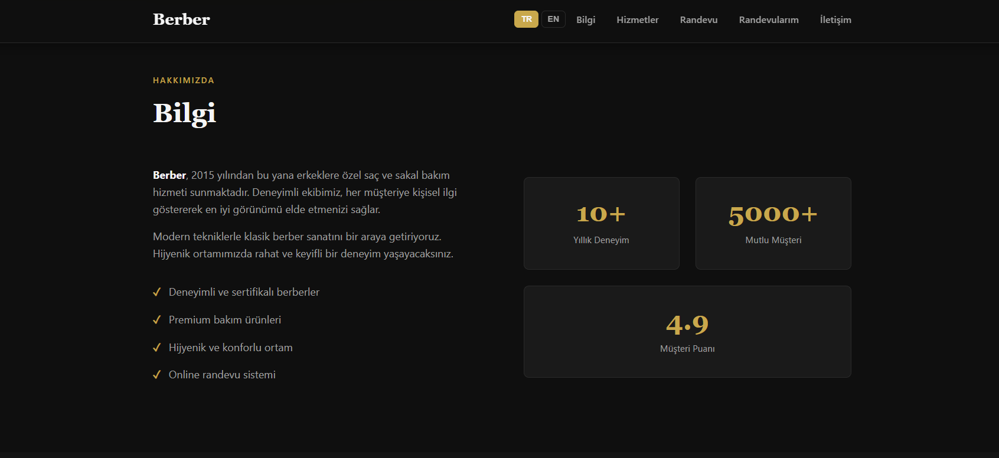
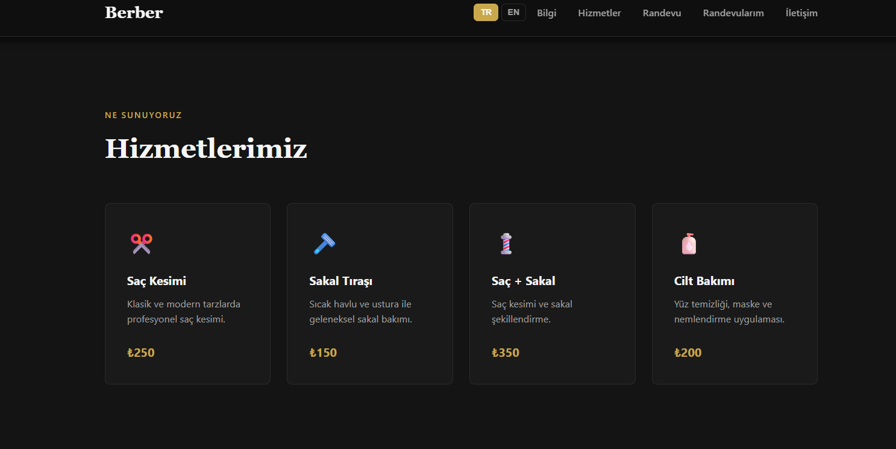
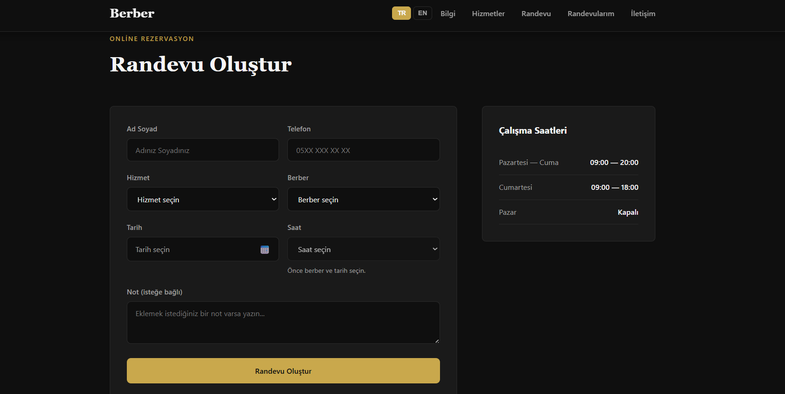
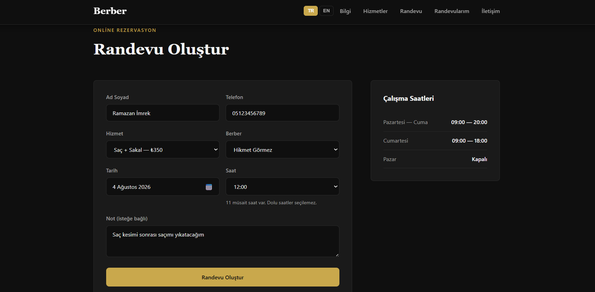
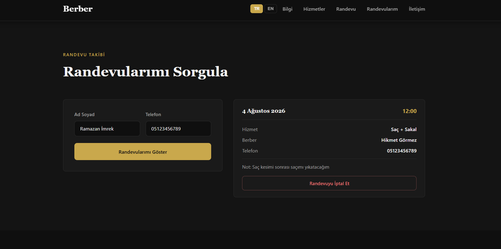
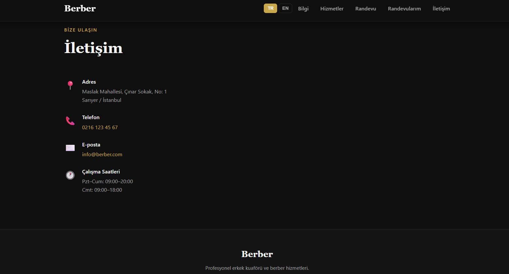
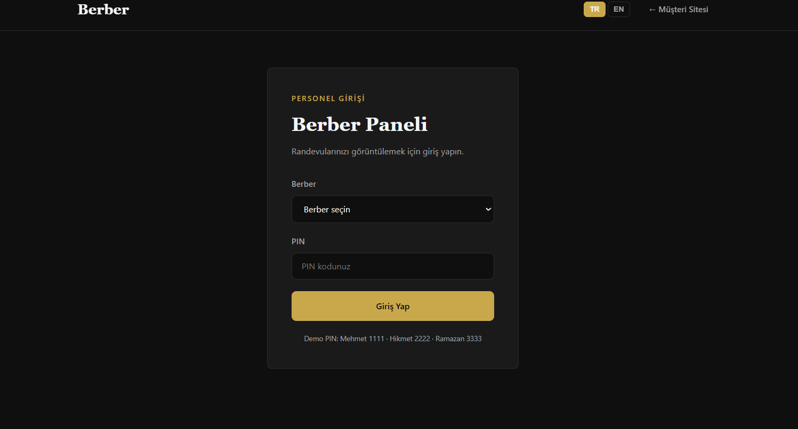
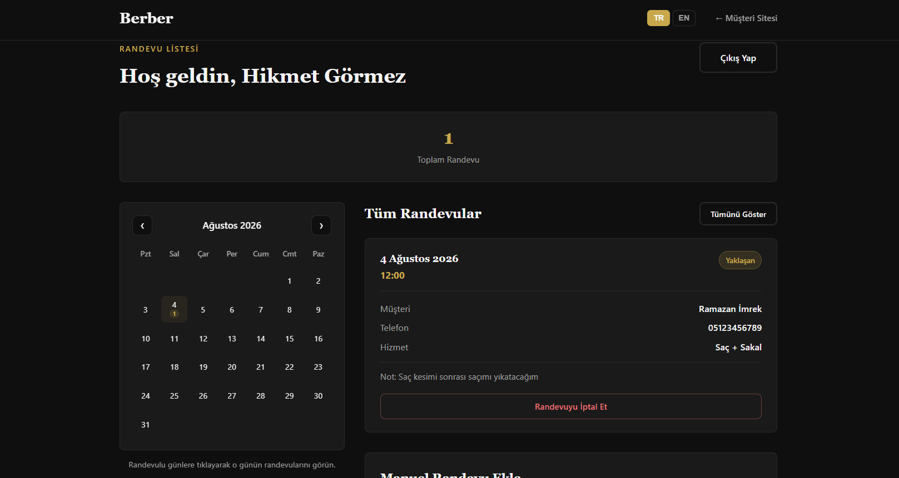
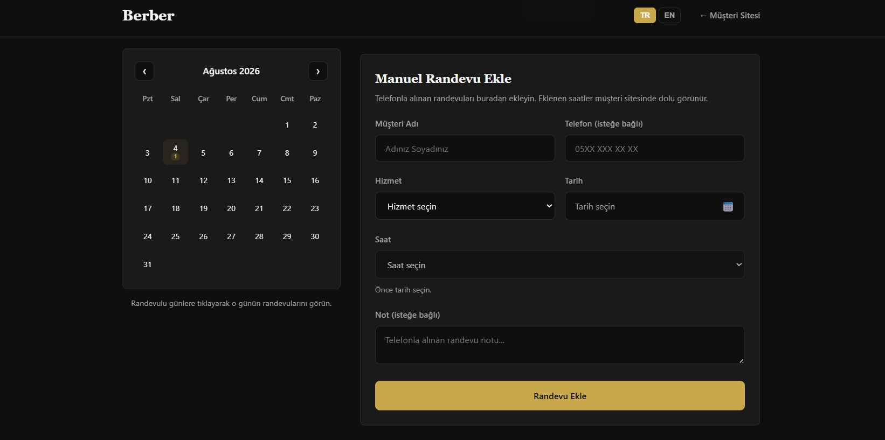

# Berber — Randevu Sistemi

> **English:** This repository includes a barber shop appointment system (customer site + barber panel). For the full English documentation, open **[docs/README.en.md](docs/README.en.md)**.

Erkek kuaförü / berber dükkanları için geliştirilmiş randevu yönetim sitesi. **TR / EN** dil desteği (müşteri sitesi ve berber paneli). Müşteriler online randevu alabilir; berberler ayrı panelden randevularını görüntüleyebilir ve telefonla alınan randevuları manuel ekleyebilir.

## Ekran görüntüleri

Aşağıdaki görseller **Türkçe (TR)** arayüzü gösterir.

### Müşteri sitesi

**Bilgi**



**Hizmetler**



**Randevu oluşturma**



**Doldurulmuş randevu formu**



**Randevu sorgulama ve iptal**



**İletişim**



### Berber paneli

**Giriş ekranı**



**Takvim, randevu listesi ve iptal**



**Manuel randevu ekleme**



## Özellikler

### Müşteri sitesi (`index.html`)

- **Bilgi** — Dükkan hakkında tanıtım
- **Hizmetler** — Saç kesimi, sakal tıraşı vb. fiyat listesi
- **Randevu oluşturma** — Berber, hizmet, açılır takvim, saat seçimi
- **Randevu sorgulama** — Ad ve telefon ile randevuları görüntüleme ve iptal etme
- **İletişim** — Adres, telefon, e-posta, çalışma saatleri
- **TR / EN** dil seçici (müşteri sitesi ve berber paneli)
- Dolu saatler otomatik işaretlenir; aynı berber + tarih + saat tekrar alınamaz
- Geçmiş randevular otomatik silinir

### Berber paneli (`berber-panel.html`)

- PIN ile berber girişi
- **TR / EN** dil seçici (müşteri sitesi ile aynı tercih paylaşılır)
- Aylık **takvim** görünümü (randevulu günler işaretli)
- Randevu listesi (güne göre filtreleme)
- **Manuel randevu ekleme** (telefonla alınan randevular için)
- Eklenen randevular müşteri sitesinde dolu saat olarak görünür

## Teknolojiler

- HTML5, CSS3
- Vanilla JavaScript (ES Modules)
- `localStorage` — randevu verisi (tarayıcıda saklanır)
- `sessionStorage` — berber oturumu

Harici framework veya build aracı kullanılmaz. **Kurulum gerekmez** — indirip yerel sunucu ile açmanız yeterli.

## GitHub'dan indirip çalıştırma

### 1. Projeyi indirin

**Seçenek A — Git ile klonlama:**

```bash
git clone https://github.com/KULLANICI_ADI/barberApp.git
cd barberApp
```

**Seçenek B — ZIP indirme:**

GitHub sayfasında **Code → Download ZIP** deyin, arşivi açın ve proje klasörüne girin.

### 2. Neden sunucu gerekli?

Proje JavaScript **ES modülleri** (`import` / `export`) kullanır. `index.html` dosyasını doğrudan çift tıklayıp açmak (`file://`) **çalışmaz**. Küçük bir yerel HTTP sunucusu başlatmanız gerekir.

### 3. Yerel sunucuyu başlatın

Proje klasöründe aşağıdaki yöntemlerden **birini** kullanın.

#### Yöntem 1 — Python (en yaygın)

Python 3 yüklüyse:

```bash
# Windows / macOS / Linux
python -m http.server 8080
```

Bazı sistemlerde:

```bash
python3 -m http.server 8080
```

#### Yöntem 2 — Node.js

Node.js yüklüyse:

```bash
npx serve .
```

veya:

```bash
npx http-server -p 8080
```

#### Yöntem 3 — VS Code / Cursor Live Server

1. Projeyi editörde açın
2. **Live Server** eklentisini kurun
3. `index.html` üzerinde sağ tık → **Open with Live Server**

### 4. Tarayıcıda açın

Sunucu çalışırken tarayıcıda şu adreslere gidin:

| Sayfa | Adres |
|-------|--------|
| Müşteri sitesi | [http://localhost:8080](http://localhost:8080) |
| Berber paneli | [http://localhost:8080/berber-panel.html](http://localhost:8080/berber-panel.html) |

> `npx serve` farklı bir port kullanıyorsa (ör. 3000), terminalde yazan adresi kullanın.

### 5. Hızlı test

1. Müşteri sitesinden bir randevu oluşturun
2. **Randevularım** bölümünden ad ve telefon ile sorgulayın
3. Footer'daki **Berber Paneli** linkinden panele girin (ör. Mehmet İmrek — PIN: `1111`)

### Sık karşılaşılan sorunlar

| Sorun | Çözüm |
|-------|--------|
| `python` bulunamadı | [python.org](https://www.python.org/downloads/) adresinden Python 3 kurun veya Node.js ile `npx serve` kullanın |
| Sayfa boş / modül hatası | Dosyayı çift tıklamayın; mutlaka `http://localhost:...` üzerinden açın |
| Randevular görünmüyor | Veriler tarayıcının `localStorage` alanındadır; farklı tarayıcı veya gizli sekme farklı veri gösterir |

## Berber paneli giriş bilgileri (demo)

| Berber          | PIN  |
|-----------------|------|
| Mehmet İmrek    | 1111 |
| Hikmet Görmez   | 2222 |
| Ramazan Hamza   | 3333 |

PIN kodları `src/config/constants.js` dosyasındaki `BARBER_PINS` alanından değiştirilebilir.

## Proje yapısı

```
barberApp/
├── index.html              # Müşteri sitesi
├── berber-panel.html       # Berber paneli
├── styles.css              # Ortak stiller
├── docs/
│   ├── README.en.md        # İngilizce dokümantasyon
│   └── screenshots/        # README ekran görüntüleri
├── README.md
└── src/
    ├── main.js             # Müşteri sitesi giriş noktası
    ├── panel-main.js       # Berber paneli giriş noktası
    ├── i18n/               # TR/EN çeviriler (müşteri sitesi + berber paneli)
    ├── config/
    │   └── constants.js    # Sabitler, berber PIN'leri
    ├── domain/             # Domain modelleri
    ├── application/        # İş kuralları, Facade
    ├── infrastructure/     # Repository (localStorage)
    ├── patterns/           # Factory, Observer (EventBus)
    ├── validation/         # Strategy, Composite doğrulama
    ├── ui/                 # View ve Controller bileşenleri
    └── utils/
        └── DateUtils.js
```

## Mimari (GOF & GRASP)

Proje katmanlı ve desen odaklı yapılandırılmıştır.

### GOF (Gang of Four)

| Desen | Kullanım |
|-------|----------|
| **Singleton** | `EventBus`, `LocalStorageAppointmentRepository`, `I18n` |
| **Factory Method** | `AppointmentFactory` — form verisinden `Appointment` üretimi |
| **Observer** | `EventBus` — randevu ve dil değişikliklerinde UI güncelleme |
| **Strategy** | `RequiredFieldsValidation`, `PhoneValidation`, `SlotAvailabilityValidation` vb. |
| **Composite** | `CompositeValidator` — birden fazla doğrulama kuralını tek akışta birleştirir |
| **Facade** | `BookingFacade`, `BarberPanelFacade` — UI için sadeleştirilmiş arayüz |

### GRASP

| İlke | Kullanım |
|------|----------|
| **Information Expert** | `Appointment` — çakışma, müşteri eşleştirme, telefon doğrulama; `TimeSlot` — müsaitlik durumu |
| **Creator** | `AppointmentFactory` — randevu nesnesini oluşturma sorumluluğu |
| **Controller** | `AppointmentFormController`, `AppointmentLookupController`, `BarberPanelController`, `BarberManualAppointmentController`; uygulama katmanında `AppointmentService` |
| **Pure Fabrication** | `EventBus`, `AvailabilityService`, `AppointmentLookupService`, `BarberPanelService`, `LocalStorageAppointmentRepository` |
| **Protected Variations** | `IAppointmentRepository` — depolama detayını (`localStorage`) soyutlar |

### Depolama

| Kavram | Kullanım |
|--------|----------|
| **Repository** | `IAppointmentRepository` / `LocalStorageAppointmentRepository` — randevu verisi erişimi |

## Yapılandırma

`src/config/constants.js` dosyasında:

- `SERVICE_LABELS` — Hizmet adları
- `BARBER_LABELS` — Berber adları
- `BARBER_PINS` — Panel giriş PIN'leri
- `TIME_SLOTS` — Çalışma saatleri (09:00–19:00)

Dükkan adı, adres, telefon ve fiyatlar `index.html` içinden düzenlenebilir. Berber adları `src/config/constants.js` dosyasındaki `BARBER_LABELS` alanından güncellenir.

**Dükkan adresi:** Maslak Mahallesi, Çınar Sokak, No: 1, Sarıyer / İstanbul

## Önemli notlar

- Veriler yalnızca **aynı tarayıcının** `localStorage` alanında tutulur; farklı cihaz veya tarayıcılar birbirini görmez.
- Pazar günleri randevu alınamaz; geçmiş randevular otomatik temizlenir.
- Müşteri randevusunda telefon zorunludur; berber manuel randevusunda telefon isteğe bağlıdır.
## Lisans

Bu proje demo amaçlı geliştirilmiştir.
