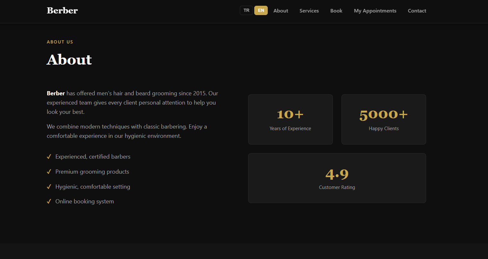
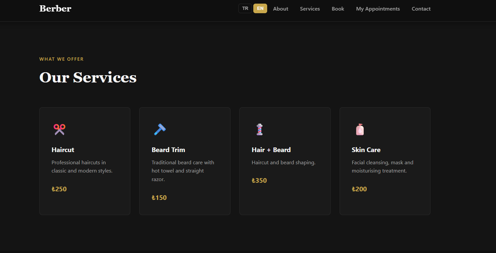
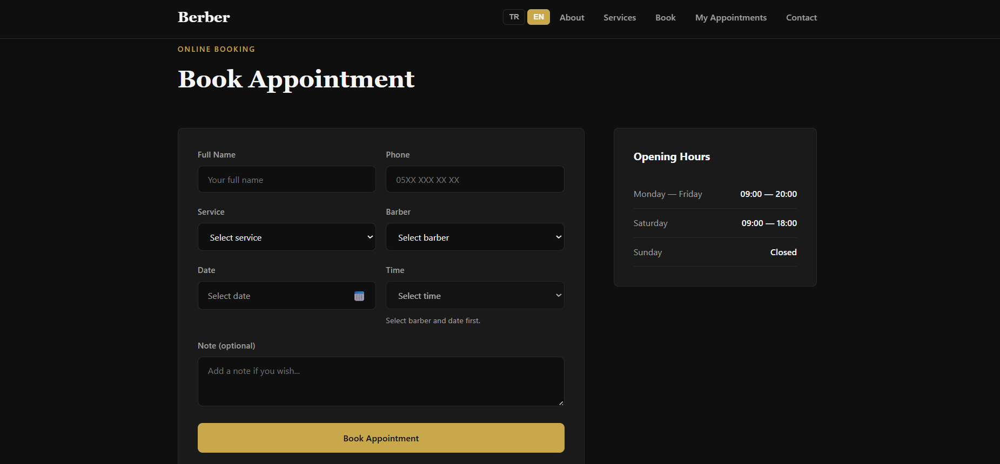
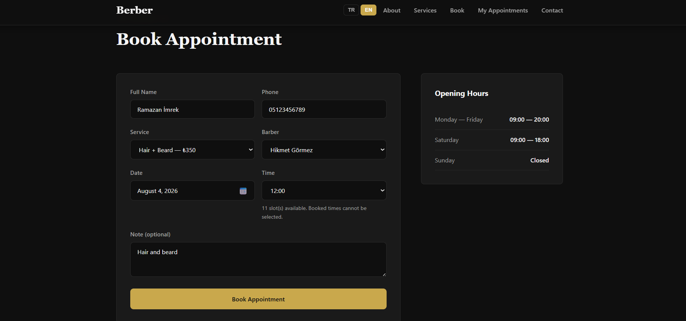
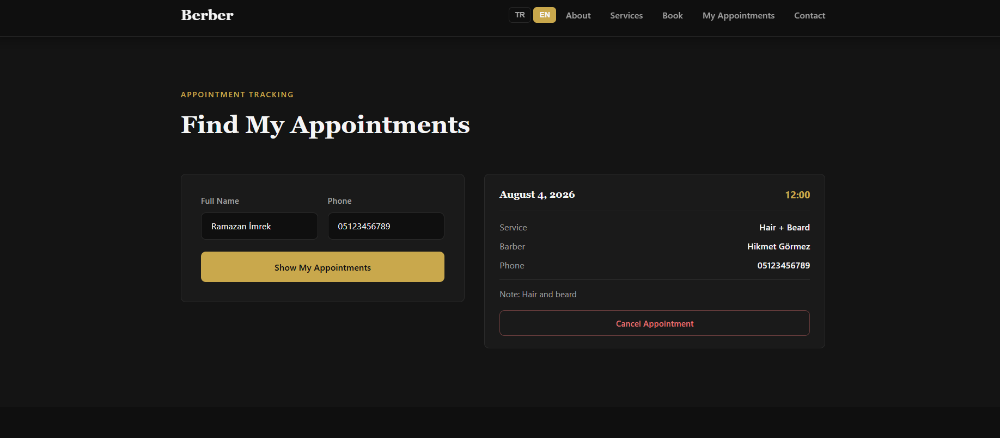
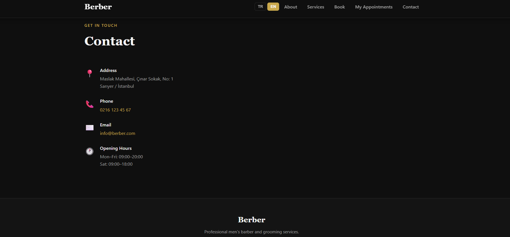
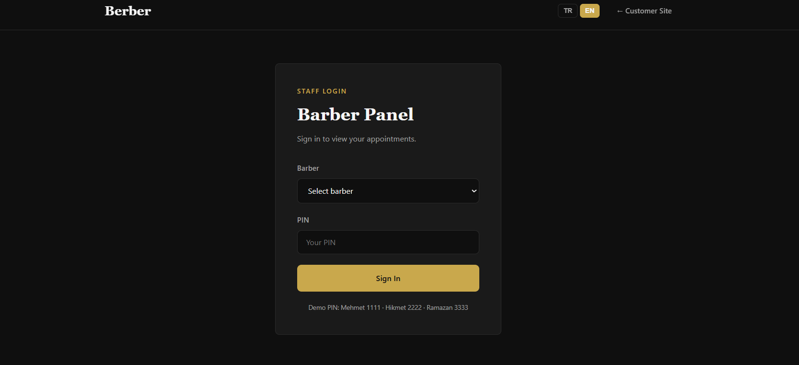
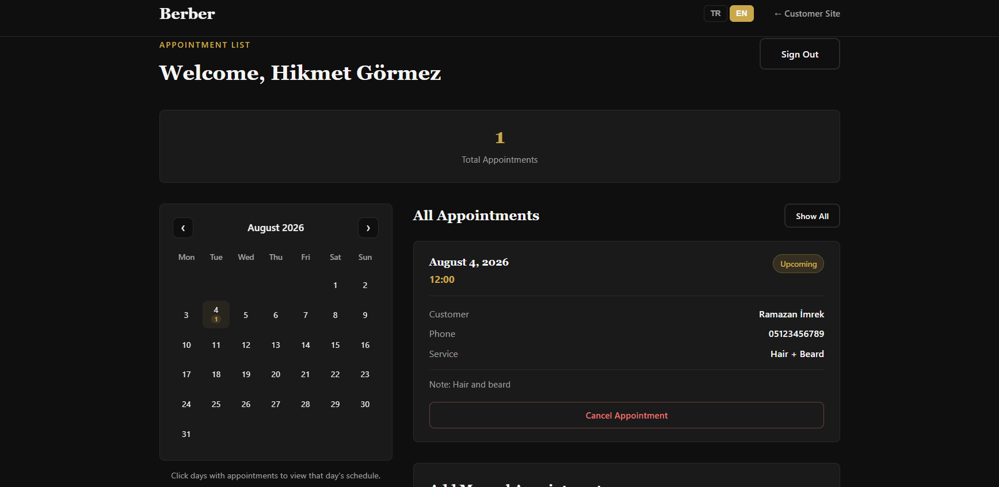
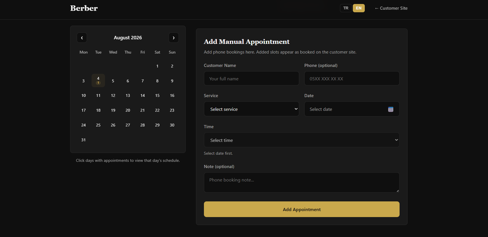

# Berber — Appointment System

> [Türkçe README](../README.md)

A barber shop appointment website with Turkish and English customer-facing UI. Customers can book online; barbers manage appointments from a separate panel and add phone bookings manually.

**Live demo:** [https://eersoy-barber.vercel.app/](https://eersoy-barber.vercel.app/) · Barber panel: [/berber-panel.html](https://eersoy-barber.vercel.app/berber-panel.html)

## Screenshots

Screens below show the **English (EN)** UI.

### Customer site

**About**



**Services**



**Book appointment**



**Filled appointment form**



**Lookup and cancel**



**Contact**



### Barber panel

**Login**



**Calendar, appointments and cancel**



**Manual appointment**



## Features

### Customer site (`index.html`)

- **About** — Shop introduction
- **Services** — Haircut, beard trim, pricing
- **Book appointment** — Barber, service, calendar, time slots
- **My appointments** — Look up and cancel by name and phone
- **Contact** — Address, phone, email, opening hours
- **TR / EN** language switcher (customer site and barber panel)
- Booked slots are blocked automatically; same barber + date + time cannot be booked twice
- Past appointments are removed automatically

### Barber panel (`berber-panel.html`)

- PIN login for barbers
- **TR / EN** language switcher (shared with customer site)
- Monthly **calendar** (days with appointments highlighted)
- Appointment list (filter by day)
- **Cancel appointments** from the panel
- **Manual booking** for phone appointments
- Manual entries appear as booked on the customer site

## Tech stack

- HTML5, CSS3
- Vanilla JavaScript (ES Modules)
- **Supabase** (PostgreSQL) — production database (Vercel)
- Node.js + Express + SQLite — local development (`npm start`)
- `localStorage` — language preference only (`appLanguage`)
- `sessionStorage` — barber session (browser)

No React/Vue or similar frontend framework. On the live site, appointments are stored persistently in **Supabase**.

## Production (Vercel + Supabase)

The app is deployed on [Vercel](https://vercel.com); appointment data lives in a [Supabase](https://supabase.com) PostgreSQL database.

## Local development (optional)

### 1. Download the project

**Option A — Git clone:**

```bash
git clone https://github.com/YOUR_USERNAME/barberApp.git
cd barberApp
```

**Option B — Download ZIP:**

On GitHub: **Code → Download ZIP**, extract, and open the project folder.

### 2. Install dependencies

[Node.js](https://nodejs.org/) (v18+ recommended) is required:

```bash
npm install
```

### 3. Start the server

```bash
npm start
```

This starts the Express API, creates the SQLite database, and serves static files (customer site + barber panel).

For auto-restart during development:

```bash
npm run dev
```

### 4. Open in the browser

| Page | URL |
|------|-----|
| Customer site | [http://localhost:8080](http://localhost:8080) |
| Barber panel | [http://localhost:8080/berber-panel.html](http://localhost:8080/berber-panel.html) |

> Change the port with `PORT=3000 npm start` (Windows PowerShell: `$env:PORT=3000; npm start`).

### 5. Quick test

1. Book an appointment on the customer site
2. Look it up under **My Appointments** with the same name and phone
3. Open **Barber Panel** from the footer (e.g. Mehmet İmrek — PIN: `1111`)

## Barber panel demo login

| Barber | PIN |
|--------|-----|
| Mehmet İmrek | 1111 |
| Hikmet Görmez | 2222 |
| Ramazan Hamza | 3333 |

Change PINs in `src/config/constants.js` → `BARBER_PINS`.

## Project structure

```
barberApp/
├── index.html              # Customer site
├── berber-panel.html       # Barber panel
├── styles.css              # Shared styles
├── env.js                  # Supabase credentials (generated on deploy)
├── env.example.js          # env.js template
├── vercel.json             # Vercel deploy config
├── package.json
├── scripts/
│   └── generate-env.js     # env.js generator (build)
├── supabase/
│   └── schema.sql          # PostgreSQL table + RLS
├── server/                 # Local dev (Express + SQLite)
│   ├── index.js
│   ├── db.js
│   └── routes/
│       └── appointments.js
├── docs/
│   ├── README.en.md
│   └── screenshots/
├── README.md
└── src/
    ├── main.js             # Customer site entry
    ├── panel-main.js       # Barber panel entry
    ├── config/
    │   ├── constants.js
    │   └── env.js          # Environment helper
    ├── domain/
    ├── application/
    ├── infrastructure/     # Repository layer
    ├── patterns/
    ├── validation/
    ├── presentation/
    │   ├── views/
    │   └── controllers/
    ├── i18n/
    └── utils/
```

## Architecture (MVC, GOF & GRASP)

The project uses a layered, pattern-oriented structure. Dependencies are wired in `main.js` and `panel-main.js` (**Composition Root**).

### MVC layers

| Layer | Folder | Responsibility |
|-------|--------|----------------|
| **Model** | `domain/` | `Appointment`, `TimeSlot` — data and domain logic |
| **View** | `presentation/views/` | DOM rendering (`*View.js`) |
| **Controller** | `presentation/controllers/` | User events, facade calls (`*Controller.js`) |

Business rules live in `application/` (Service, Facade), not in the Model. Controllers never access the repository directly.

### GOF (Gang of Four)

| Pattern | Usage |
|---------|--------|
| **Singleton** | `EventBus`, `SupabaseAppointmentRepository`, `ApiAppointmentRepository`, `I18n` |
| **Factory Method** | `AppointmentFactory` — builds `Appointment` from form data |
| **Observer** | `EventBus` — UI updates on appointment and language changes |
| **Strategy** | `RequiredFieldsValidation`, `PhoneValidation`, `SlotAvailabilityValidation`, etc. |
| **Composite** | `CompositeValidator` — combines multiple validation rules in one flow |
| **Facade** | `BookingFacade`, `BarberPanelFacade` — simplified interface for the UI |

### GRASP

| Principle | Usage |
|-----------|--------|
| **Information Expert** | `Appointment` — conflicts, customer matching, phone validation; `TimeSlot` — availability state |
| **Creator** | `AppointmentFactory` — responsible for creating appointment objects |
| **Controller** | `AppointmentFormController`, `AppointmentLookupController`, `BarberPanelController`, `BarberManualAppointmentController`, `TimeSlotPresenter`; application-layer `AppointmentService` |
| **Pure Fabrication** | `EventBus`, `AvailabilityService`, `AppointmentLookupService`, `BarberPanelService`, `SupabaseAppointmentRepository`, `ApiAppointmentRepository` |
| **Protected Variations** | `IAppointmentRepository` — abstracts storage (Supabase / Express API) |

### Storage

| Environment | Repository | Database |
|-------------|------------|----------|
| **Vercel** | `SupabaseAppointmentRepository` | Supabase (PostgreSQL) |
| **Local (`npm start`)** | `ApiAppointmentRepository` | SQLite (`server/data/barber.db`) |

`createAppointmentRepository()` picks the implementation based on environment variables.

## Configuration

In `src/config/constants.js`:

- `SERVICE_LABELS` — Service names
- `BARBER_LABELS` — Barber names
- `BARBER_PINS` — Panel login PINs
- `TIME_SLOTS` — Hours (09:00–19:00)

Customer-facing copy and prices can be edited in `index.html`. Barber names are in `BARBER_LABELS`.

**Shop address:** Maslak Mahallesi, Çınar Sokak, No: 1, Sarıyer / İstanbul

## Notes

- On the **live site**, appointments are stored persistently in Supabase PostgreSQL.
- In **local development**, appointments are stored in SQLite (`server/data/barber.db`).
- Language preference uses browser `localStorage`; barber session uses `sessionStorage`.
- Sundays are closed for booking; past appointments are cleaned up automatically.
- Phone is required for customer bookings; optional for manual barber bookings.

## License

This project is for demo purposes.
