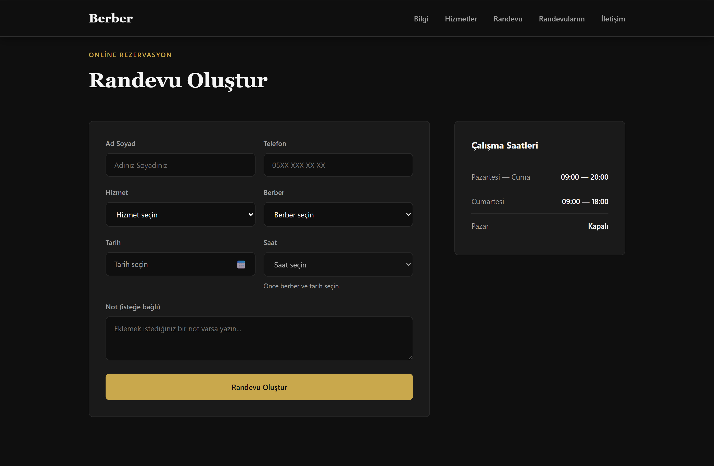
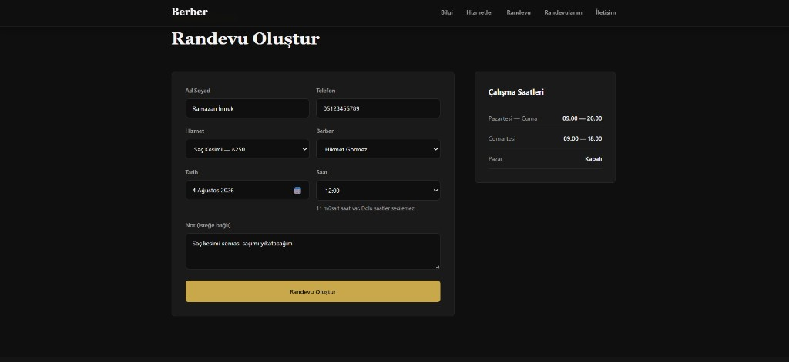
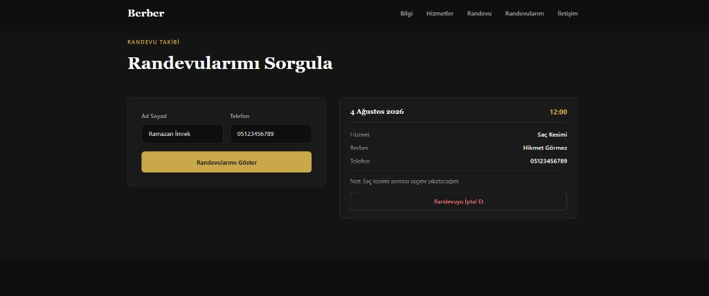
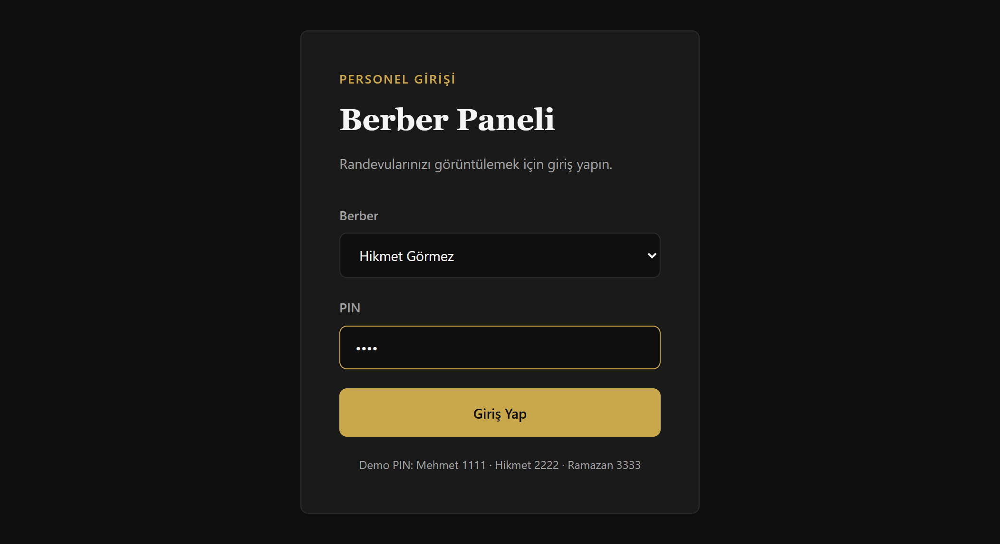
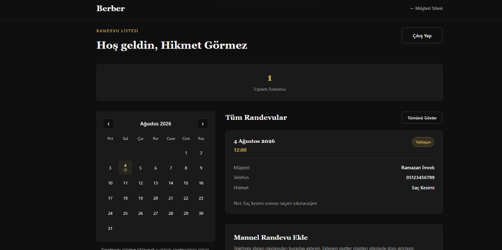
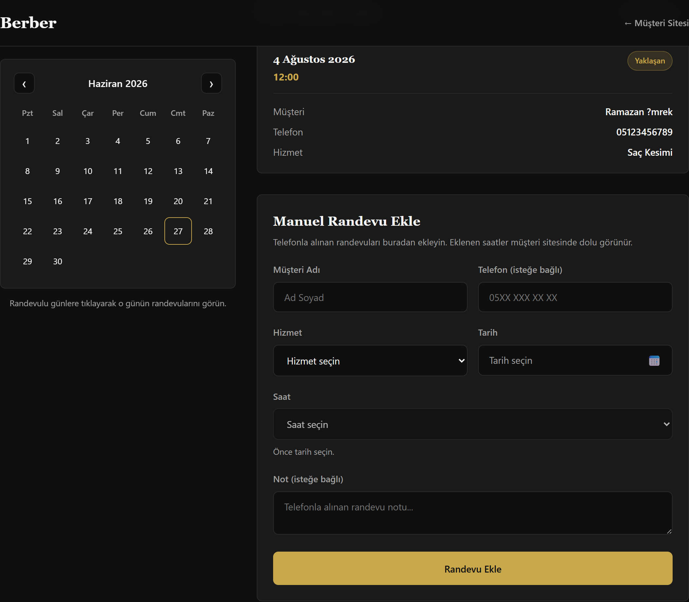

# Berber — Appointment System

> [Türkçe README](../README.md)

A barber shop appointment website with Turkish and English customer-facing UI. Customers can book online; barbers manage appointments from a separate panel and add phone bookings manually.

## Screenshots

### Customer site

**Book appointment**



**Filled appointment form**



**Lookup and cancel**



### Barber panel

**Login**



**Calendar and appointment list**



**Manual appointment**



## Features

### Customer site (`index.html`)

- **About** — Shop introduction
- **Services** — Haircut, beard trim, pricing
- **Book appointment** — Barber, service, calendar, time slots
- **My appointments** — Look up and cancel by name and phone
- **Contact** — Address, phone, email, opening hours
- **TR / EN** language switcher (customer site and barber panel)
- Booked slots are blocked automatically; same barber + date + time cannot be booked twice
- Past appointments are removed automatically

### Barber panel (`berber-panel.html`)

- PIN login for barbers
- **TR / EN** language switcher (shared with customer site)
- Monthly **calendar** (days with appointments highlighted)
- Appointment list (filter by day)
- **Manual booking** for phone appointments
- Manual entries appear as booked on the customer site

## Tech stack

- HTML5, CSS3
- Vanilla JavaScript (ES Modules)
- `localStorage` — appointment data (browser-only)
- `sessionStorage` — barber session

No external framework or build step. **No install required** — download and run a local server.

## Run from GitHub

### 1. Download the project

**Option A — Git clone:**

```bash
git clone https://github.com/YOUR_USERNAME/barberApp.git
cd barberApp
```

**Option B — Download ZIP:**

On GitHub: **Code → Download ZIP**, extract, and open the project folder.

### 2. Why a local server?

The app uses JavaScript **ES modules** (`import` / `export`). Opening `index.html` directly (`file://`) **will not work**. You need a small local HTTP server.

### 3. Start a local server

From the project folder, use **one** of these:

#### Option 1 — Python

```bash
python -m http.server 8080
```

On some systems:

```bash
python3 -m http.server 8080
```

#### Option 2 — Node.js

```bash
npx serve .
```

or:

```bash
npx http-server -p 8080
```

#### Option 3 — VS Code / Cursor Live Server

1. Open the project in your editor
2. Install the **Live Server** extension
3. Right-click `index.html` → **Open with Live Server**

### 4. Open in the browser

| Page | URL |
|------|-----|
| Customer site | [http://localhost:8080](http://localhost:8080) |
| Barber panel | [http://localhost:8080/berber-panel.html](http://localhost:8080/berber-panel.html) |

> If `npx serve` uses another port (e.g. 3000), use the URL shown in the terminal.

### 5. Quick test

1. Book an appointment on the customer site
2. Look it up under **My Appointments** with the same name and phone
3. Open **Barber Panel** from the footer (e.g. Mehmet İmrek — PIN: `1111`)

### Troubleshooting

| Issue | Fix |
|-------|-----|
| `python` not found | Install Python 3 from [python.org](https://www.python.org/downloads/) or use `npx serve` |
| Blank page / module error | Do not double-click the HTML file; use `http://localhost:...` |
| Appointments missing | Data lives in the browser `localStorage`; another browser or incognito window uses separate data |

## Barber panel demo login

| Barber | PIN |
|--------|-----|
| Mehmet İmrek | 1111 |
| Hikmet Görmez | 2222 |
| Ramazan Hamza | 3333 |

Change PINs in `src/config/constants.js` → `BARBER_PINS`.

## Project structure

```
barberApp/
├── index.html              # Customer site
├── berber-panel.html       # Barber panel
├── styles.css              # Shared styles
├── docs/
│   ├── README.en.md        # English documentation (this file)
│   └── screenshots/        # README screenshots
├── README.md               # Turkish documentation (GitHub default)
└── src/
    ├── main.js             # Customer site entry
    ├── panel-main.js       # Barber panel entry
    ├── i18n/               # TR/EN translations (customer site + barber panel)
    ├── config/
    │   └── constants.js    # Constants, barber PINs
    ├── domain/
    ├── application/
    ├── infrastructure/
    ├── patterns/
    ├── validation/
    ├── ui/
    └── utils/
        └── DateUtils.js
```

## Architecture (GOF & GRASP)

| Pattern | Usage |
|---------|--------|
| **Singleton** | `EventBus`, `LocalStorageAppointmentRepository` |
| **Factory** | `AppointmentFactory` |
| **Observer** | `EventBus` — UI updates on appointment changes |
| **Strategy** | Phone, required fields, slot validation |
| **Composite** | `CompositeValidator` |
| **Facade** | `BookingFacade`, `BarberPanelFacade` |
| **Repository** | `IAppointmentRepository` — storage abstraction |
| **Controller** | Form controllers |
| **Information Expert** | `Appointment` — conflicts and customer matching |

## Configuration

In `src/config/constants.js`:

- `SERVICE_LABELS` — Service names (legacy)
- `BARBER_LABELS` — Barber names
- `BARBER_PINS` — Panel login PINs
- `TIME_SLOTS` — Hours (09:00–19:00)

Customer-facing copy and prices can be edited in `index.html` and `src/i18n/translations.js`. Barber names are in `BARBER_LABELS`.

**Shop address:** Maslak Mahallesi, Çınar Sokak, No: 1, Sarıyer / İstanbul

## Notes

- Data is stored only in the **same browser’s** `localStorage`; other devices or browsers do not share it.
- Sundays are closed for booking; past appointments are cleaned up automatically.
- Phone is required for customer bookings; optional for manual barber bookings.

## License

This project is for demo purposes.
